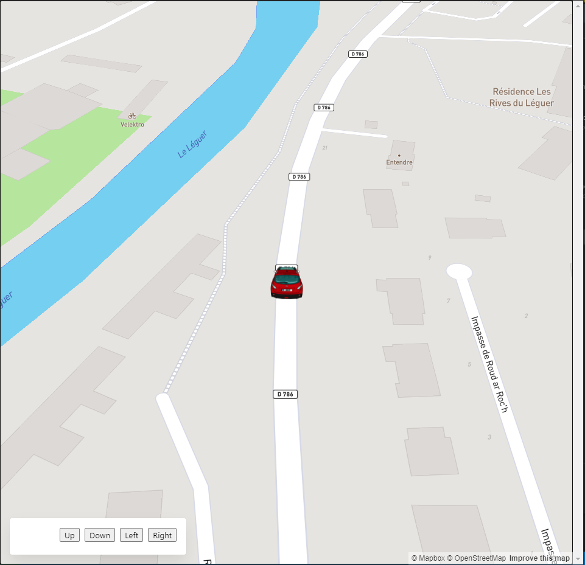

DrivingOsmGame
===============

Prototype of driving simulation with OpenStreetMap

> **[Demo (YouTube video)](https://www.youtube.com/watch?v=O2W8V2R5EaQ)**

 

## Keyboard controls
- <kbd>↑</kbd> : Increase car speed
- <kbd>↓</kbd> : Decrease car speed
- <kbd>←</kbd> : If the right indicator is on, turn it off. Otherwise turn on the left indicator
- <kbd>→</kbd> : If the left indicator is on, turn it off. Otherwise turn on the right indicator

When the left/right indicator is on, the car will turn at the next intersection if possible.

## Launch

1. Create an account / login at https://www.mapbox.com/
2. At https://account.mapbox.com , copy/paste your `Default public token` in `index.ts -> mapboxAccessToken`
3. Clone this repositery
4. `npm install`
5. `npm run start` (URL : http://localhost:8080/)

**If you get stuck, refresh the page.**
